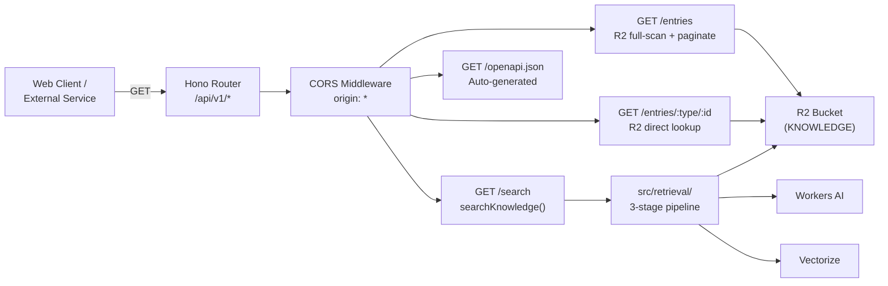

# API

> Public read-only REST API built with Hono + OpenAPI, providing entry listing, single entry retrieval, and semantic search.

**Source:** `src/api/`
**Files:** 2 (`routes.ts`, `schemas.ts`)
**Spec reference:** `docs/spec.md` sections 8, 10
**Depends on:** `types` (`ContentTypeSchema`, `ListParamsSchema`, `SearchParamsSchema`, response schemas), `retrieval` (`searchKnowledge`), `types/storage` (`toR2Key`, `R2Document`)
**Depended on by:** `index` (mounted at `/api/v1` via Hono routing)

---

## Overview

The API module provides a public REST API for the knowledge base, designed for web frontends and external integrations that don't use MCP. It exposes three routes plus an auto-generated OpenAPI spec, all read-only, all unauthenticated (Phase 1).

The API is built with `@hono/zod-openapi`, which combines Hono's routing with Zod schema validation and automatic OpenAPI 3.1 document generation. Route parameters and responses are validated at runtime and documented in the generated spec at `/api/v1/openapi.json`.

CORS is configured for universal access (`origin: '*'`, GET/HEAD/OPTIONS only). All GET responses include cache headers (`public, max-age=300, stale-while-revalidate=3600`) for CDN and browser caching.

## Data Flow Diagram



## File-by-File Reference

### `routes.ts`

**Purpose:** Defines the Hono app with three API routes and the OpenAPI spec endpoint.

#### Exports

| Export | Kind | Signature | Description |
|--------|------|-----------|-------------|
| `api` | `OpenAPIHono` instance | `OpenAPIHono<{ Bindings: Env }>` | The Hono app, mounted by `src/index.ts` at `/api/v1` |

#### Internal Logic

**App setup:**
- Uses `OpenAPIHono` (not plain `Hono`) for automatic OpenAPI generation
- Global error handler returns `{ error: { code: 'INTERNAL_ERROR', message: '...' } }` with 500 status
- CORS middleware: `origin: '*'`, methods: `GET, HEAD, OPTIONS`, headers: `Content-Type, Accept`, max-age: 86400 (24h preflight cache)
- Cache headers constant: `Cache-Control: public, max-age=300, stale-while-revalidate=3600`

---

**`GET /entries` — List/filter entries**

Query parameters (validated by `ListQuerySchema`):
| Param | Type | Default | Description |
|-------|------|---------|-------------|
| `contentType` | ContentType | (none) | Filter by content type |
| `group` | string | (none) | Filter by group metadata |
| `release` | string | (none) | Filter by release metadata |
| `limit` | number | 20 | Page size (1-100) |
| `offset` | number | 0 | Pagination offset |

Response: `{ data: R2Document[], total: number, offset: number, limit: number }`

Algorithm:
1. Build R2 list prefix: `content/{contentType}/` if filtered, `content/` otherwise
2. Paginate through R2 listing using cursor (handles truncated results with `limit: 1000` per page)
3. Batch-fetch all R2 objects in parallel via `Promise.all()`
4. Filter by `group` and `release` metadata (post-fetch filtering)
5. Calculate `total` from filtered count
6. Slice for pagination: `entries.slice(offset, offset + limit)`

**Performance note:** This route does a full R2 scan — it lists ALL objects under the prefix, fetches ALL of them, then paginates in memory. This works for the current dataset size but would need optimization (e.g., a metadata index in KV) for thousands of documents.

---

**`GET /entries/{contentType}/{id}` — Single entry**

Path parameters (validated by `EntryParamsSchema`):
| Param | Type | Description |
|-------|------|-------------|
| `contentType` | ContentType | Content type |
| `id` | string (min 1) | Document ID |

Responses:
- 200: `{ data: R2Document }`
- 404: `{ error: { code: 'NOT_FOUND', message: 'Entry {type}/{id} not found' } }`

Algorithm:
1. Construct R2 key using `toR2Key(contentType, id)`
2. Fetch from R2
3. Return 404 if not found, 200 with document if found

---

**`GET /search` — Semantic search**

Query parameters (validated by `SearchQuerySchema`):
| Param | Type | Default | Description |
|-------|------|---------|-------------|
| `q` | string (required) | | Search query |
| `contentType` | ContentType | (none) | Filter by content type |
| `group` | string | (none) | Filter by group |
| `release` | string | (none) | Filter by release |
| `limit` | number | 5 | Max results (1-20) |

Response: `{ results: SearchResult[] }`

Algorithm:
1. Delegates to `searchKnowledge()` from the retrieval module
2. Passes `{ contentType, group, release }` as filters
3. Does NOT request `includeDocuments` (lightweight results only)
4. Slices results to the requested `limit`

---

**`GET /openapi.json` — OpenAPI spec**

Auto-generated by `@hono/zod-openapi` from route definitions and Zod schemas.

```json
{
  "openapi": "3.1.0",
  "info": {
    "title": "SuperBenefit Knowledge API",
    "version": "0.1.0",
    "description": "Public read-only API for the SuperBenefit knowledge base"
  }
}
```

#### Dependencies
- **Internal:** `./schemas`, `../types/storage` (toR2Key, R2Document), `../retrieval` (searchKnowledge)
- **External:** `@hono/zod-openapi` (OpenAPIHono, createRoute), `hono/cors`

---

### `schemas.ts`

**Purpose:** Route-level parameter schemas and re-exports of response schemas for OpenAPI generation.

#### Exports

| Export | Kind | Description |
|--------|------|-------------|
| `EntryParamsSchema` | Zod object | Path params: `{ contentType: ContentType, id: string }` with OpenAPI param annotations |
| `ListQuerySchema` | Zod object | `ListParamsSchema` with `.openapi('ListQuery')` |
| `SearchQuerySchema` | Zod object | `SearchParamsSchema` with `.openapi('SearchQuery')` |
| `EntryListResponseSchema` | Re-export | From `types/api.ts` |
| `EntryResponseSchema` | Re-export | From `types/api.ts` |
| `SearchResponseSchema` | Re-export | From `types/api.ts` |
| `ErrorResponseSchema` | Re-export | From `types/api.ts` |

#### Internal Logic

The `EntryParamsSchema` adds OpenAPI parameter metadata (`{ param: { name, in: 'path' } }`) to the content type and ID fields. This enables proper path parameter documentation in the generated OpenAPI spec.

`ListQuerySchema` and `SearchQuerySchema` are thin wrappers that add `.openapi()` names to the existing type schemas, enabling them to appear as named components in the OpenAPI spec.

Response schemas are re-exported unchanged — they already have `.openapi()` annotations from `types/api.ts`.

#### Dependencies
- **Internal:** `../types/content` (ContentTypeSchema), `../types/api` (ListParamsSchema, SearchParamsSchema, response schemas)
- **External:** `@hono/zod-openapi`

---

## Key Types

| Type | Source | Description |
|------|--------|-------------|
| `R2Document` | `types/storage.ts` | Document shape returned in responses |
| `ListParams` | `types/api.ts` | Validated query params for listing |
| `SearchParams` | `types/api.ts` | Validated query params for search |
| `SearchResult` | `types/api.ts` | Search result shape |
| `ContentType` | `types/content.ts` | Valid content type for path/query params |

See [types.md](types.md) for full definitions.

## Cloudflare Bindings Used

| Binding | Type | Usage |
|---------|------|-------|
| `KNOWLEDGE` | `R2Bucket` | List entries, get entries |
| `AI` | `Ai` | Via `searchKnowledge()` — embedding + reranking |
| `VECTORIZE` | `VectorizeIndex` | Via `searchKnowledge()` — similarity search |
| `RERANK_CACHE` | `KVNamespace` | Via `searchKnowledge()` — reranker cache |

## Configuration and Limits

| Setting | Value | Source |
|---------|-------|--------|
| CORS origin | `*` | `routes.ts` |
| CORS methods | `GET, HEAD, OPTIONS` | `routes.ts` |
| CORS preflight max-age | 86400 (24h) | `routes.ts` |
| Cache-Control | `public, max-age=300, stale-while-revalidate=3600` | `routes.ts` |
| List limit range | 1-100 (default 20) | `types/api.ts` |
| Search limit range | 1-20 (default 5) | `types/api.ts` |
| R2 list page size | 1000 (Cloudflare max) | `routes.ts` |

## Error Handling

| Failure | Response |
|---------|----------|
| Validation error (bad params) | 400 with Zod error details (via `@hono/zod-openapi`) |
| Entry not found | 404: `{ error: { code: 'NOT_FOUND', message: '...' } }` |
| Unhandled exception | 500: `{ error: { code: 'INTERNAL_ERROR', message: 'An unexpected error occurred' } }` |
| CORS preflight | 204 with appropriate headers (via Hono CORS middleware) |

## Example Requests

```bash
# List all entries
curl http://localhost:8788/api/v1/entries

# List patterns only
curl http://localhost:8788/api/v1/entries?contentType=pattern

# List with pagination
curl http://localhost:8788/api/v1/entries?limit=10&offset=20

# Get a specific entry
curl http://localhost:8788/api/v1/entries/pattern/cell-governance

# Semantic search
curl 'http://localhost:8788/api/v1/search?q=governance+patterns'

# Search with filters
curl 'http://localhost:8788/api/v1/search?q=coordination&contentType=practice&limit=3'

# OpenAPI spec
curl http://localhost:8788/api/v1/openapi.json

# CORS preflight
curl -I -X OPTIONS http://localhost:8788/api/v1/entries \
  -H "Origin: https://example.com" \
  -H "Access-Control-Request-Method: GET"
```

## Extension Points

**Adding a new API route:**
1. Define query/path param schemas in `schemas.ts` using `@hono/zod-openapi`
2. Create the route definition with `createRoute()` in `routes.ts`
3. Implement the handler with `api.openapi(route, handler)`
4. Response schemas are automatically included in the OpenAPI spec

**Adding authentication (Phase 2):**
1. Add a Hono middleware that reads the `CF-Access-Jwt-Assertion` header
2. Call `resolveAuthContext()` to determine the tier
3. Apply the middleware to routes that require authentication

## Cross-References

- [types.md](types.md) — `ListParams`, `SearchParams`, `SearchResult`, `R2Document`, `ErrorResponse`
- [retrieval.md](retrieval.md) — `searchKnowledge()` pipeline used by the search route
- [index.md](index.md) — Where the API is mounted at `/api/v1`
- `docs/spec.md` sections 8, 10 — REST API and error handling specification
