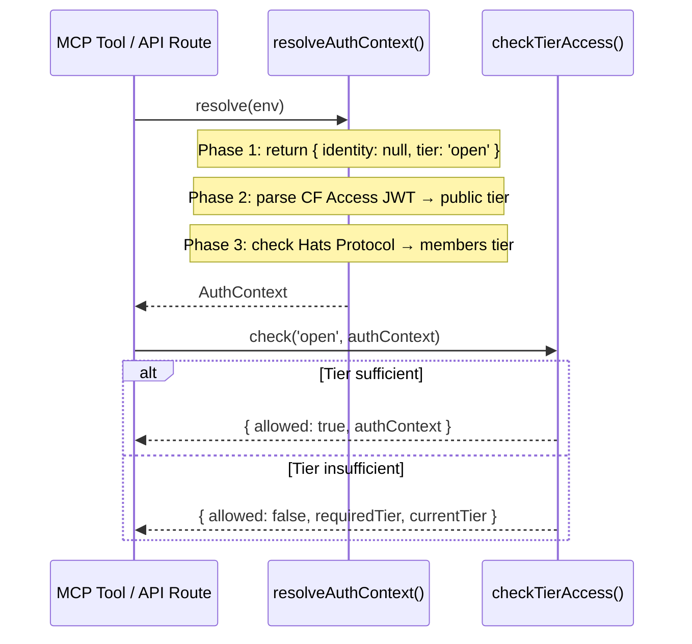

# Auth

> Implements the porch access control framework — a three-tier authorization model that gates tool and resource access.

**Source:** `src/auth/`
**Files:** 3 (`index.ts`, `resolve.ts`, `check.ts`)
**Spec reference:** `docs/spec.md` section 2
**Depends on:** `types` (`types/auth.ts`)
**Depended on by:** `mcp` (every tool calls both functions)

---

## Overview

The auth directory implements the "porch" access control framework — a metaphor for the layers of access to a house: the porch (open/public), the living room (public/authenticated), and private rooms (members). In Phase 1, the entire system operates at the porch level: all requests are anonymous and all tools are open.

The design is deliberately simple now but structured for evolution. Two functions form the entire API surface: `resolveAuthContext()` determines *who* is making the request and *what tier* they have, while `checkTierAccess()` determines *whether* that tier is sufficient for a given operation. Tools never resolve tiers themselves — they call these two functions and act on the result.

The `_env` parameter on `resolveAuthContext()` exists now (even though Phase 1 doesn't use it) because Phase 2 will need it to parse Cloudflare Access JWTs from the environment.

## Data Flow Diagram



## File-by-File Reference

### `index.ts`

**Purpose:** Barrel file re-exporting the two public functions.

#### Exports

| Export | Kind | Source |
|--------|------|--------|
| `resolveAuthContext` | Function | `./resolve` |
| `checkTierAccess` | Function | `./check` |

---

### `resolve.ts`

**Purpose:** Resolves the access context (identity + tier) for the current request.

#### Exports

| Export | Kind | Signature | Description |
|--------|------|-----------|-------------|
| `resolveAuthContext` | Async function | `(_env: Env) => Promise<AuthContext>` | Returns the resolved auth context |

#### Internal Logic

**Phase 1 implementation:** Always returns `{ identity: null, tier: 'open' }`. The function is async and accepts `_env` (underscore-prefixed, unused) to maintain the interface contract for future phases.

**Phase 2 extension path:**
1. Read the `CF-Access-Jwt-Assertion` header from the request
2. Verify the JWT against `env.CF_ACCESS_AUD` (already declared in `env.d.ts` as optional)
3. Extract user identity from JWT claims
4. Return `{ identity: { userId, name, email, provider: 'github' }, tier: 'public' }`

**Phase 3 extension path:**
1. After Phase 2 JWT verification, extract the user's Ethereum address
2. Call Hats Protocol contract on Optimism to check hat ownership
3. If the user wears the required hat, return `tier: 'members'`

#### Dependencies
- **Internal:** `../types/auth` (AuthContext type)

---

### `check.ts`

**Purpose:** Checks whether an auth context meets a required access tier.

#### Exports

| Export | Kind | Signature | Description |
|--------|------|-----------|-------------|
| `checkTierAccess` | Function | `(requiredTier: AccessTier, authContext: AuthContext) => TierAccessResult` | Pure synchronous tier comparison |

#### Internal Logic

Uses `TIER_LEVEL` numeric ordering for comparison:

```
open (0) < public (1) < members (2)
```

Returns a discriminated union result:
- `{ allowed: true, authContext }` — access granted, includes the auth context for downstream use (e.g., extracting `identity.userId`)
- `{ allowed: false, requiredTier, currentTier }` — access denied, includes both tiers for error messaging

The `TierAccessResult` type is defined locally (not exported from types) as:

```typescript
type TierAccessResult =
  | { allowed: true; authContext: AuthContext }
  | { allowed: false; requiredTier: AccessTier; currentTier: AccessTier };
```

This discriminated union pattern allows callers to narrow the type after checking `allowed`:

```typescript
const access = checkTierAccess('open', authContext);
if (!access.allowed) {
  // TypeScript knows: access.requiredTier, access.currentTier
  return errorResponse(access.requiredTier);
}
// TypeScript knows: access.authContext
const userId = access.authContext.identity?.userId;
```

#### Dependencies
- **Internal:** `../types/auth` (AccessTier, AuthContext, TIER_LEVEL)

---

## Key Types

| Type | Defined In | Description |
|------|-----------|-------------|
| `AccessTier` | `types/auth.ts` | `'open' \| 'public' \| 'members'` |
| `AuthContext` | `types/auth.ts` | `{ identity: Identity \| null, tier: AccessTier }` |
| `Identity` | `types/auth.ts` | `{ userId, name, email, provider }` |
| `TIER_LEVEL` | `types/auth.ts` | `{ open: 0, public: 1, members: 2 }` |
| `TierAccessResult` | `check.ts` (local) | Discriminated union on `allowed` |

See [types.md](types.md) for full type definitions.

## Cloudflare Bindings Used

| Binding | Type | Usage |
|---------|------|-------|
| `CF_ACCESS_AUD` | `string?` | Phase 2: Cloudflare Access audience tag for JWT verification |

Phase 1 uses no bindings. The `env` parameter is accepted but unused.

## Error Handling

The auth module itself never throws. `resolveAuthContext()` returns a valid context in all cases (Phase 1 always returns open tier). `checkTierAccess()` is a pure function that returns a result union — callers check `allowed` and handle denial themselves.

When access is denied, MCP tools return:
```json
{
  "content": [{ "type": "text", "text": "Requires members access. Current: open." }],
  "isError": true
}
```

## Extension Points

**Adding a new access tier:**
1. Add the tier to the `AccessTier` type and `AccessTierSchema` in `types/auth.ts`
2. Add its numeric level to `TIER_LEVEL` (higher = more privileged)
3. Add resolution logic to `resolveAuthContext()` in `resolve.ts`
4. No changes needed to `checkTierAccess()` — it works with any tier

**Upgrading a tool's tier (e.g., Phase 3 Members):**
1. In `src/mcp/tools.ts`, change the `checkTierAccess('open', ...)` call to `checkTierAccess('members', ...)`
2. No other changes needed — the auth module handles the rest

**Phase 2 implementation checklist:**
1. Set `CF_ACCESS_AUD` secret via `wrangler secret put`
2. Update `resolveAuthContext()` to read and verify the Access JWT
3. Map JWT claims to `Identity` fields
4. Return `tier: 'public'` for valid JWTs, `tier: 'open'` otherwise

## Cross-References

- [types.md](types.md) — `AccessTier`, `AuthContext`, `Identity` type definitions
- [mcp.md](mcp.md) — How tools use the guard pattern with `resolveAuthContext()` + `checkTierAccess()`
- `CLAUDE.md` — Guard boilerplate snippet
- `docs/spec.md` section 2 — Full porch access control specification
