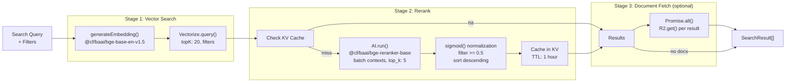

# Retrieval

> Implements the three-stage search pipeline: Vectorize similarity search, BGE reranking with caching, and optional R2 document fetch.

**Source:** `src/retrieval/`
**Files:** 4 (`index.ts`, `search.ts`, `rerank.ts`, `fetch.ts`)
**Spec reference:** `docs/spec.md` sections 6.1-6.3
**Depends on:** `types` (`SearchFilters`, `SearchResult`, `RerankResult`, `R2Document`, `VectorizeMetadata`, `VECTORIZE_LIMITS`, `VECTORIZE_NAMESPACE`, `toR2Key`)
**Depended on by:** `mcp` (tools), `api` (search route)

---

## Overview

The retrieval module implements the core search pipeline that both MCP tools and the REST API use. It is a three-stage process designed to maximize relevance while minimizing latency and cost:

1. **Stage 1 — Vector Search:** Generates a BGE embedding for the query and searches Vectorize with optional metadata filters, returning up to 20 candidates.
2. **Stage 2 — Reranking:** Passes the candidates through the BGE reranker model in a single batch API call, normalizes scores with sigmoid, filters below 0.5, and caches results in KV for 1 hour.
3. **Stage 3 — Document Fetch (optional):** Fetches full R2 documents for the final results, only when `includeDocuments` is requested.

The key design insight is that metadata stored in Vectorize (`content`, `description` fields) provides enough context for reranking without R2 round-trips. Full document fetches are deferred to Stage 3 and only happen when explicitly requested.

## Data Flow Diagram

## File-by-File Reference

### `index.ts`

**Purpose:** Orchestrator that wires the three stages together and exports individual stage functions.

#### Exports

| Export | Kind | Signature | Description |
|--------|------|-----------|-------------|
| `searchKnowledge` | Async function | `(query, filters, options?, env) => Promise<SearchResult[]>` | Main entry point — runs all three stages |
| `searchWithFilters` | Re-export | From `./search` | Stage 1 |
| `generateEmbedding` | Re-export | From `./search` | Embedding helper |
| `rerankResults` | Re-export | From `./rerank` | Stage 2 |
| `hashQuery` | Re-export | From `./rerank` | Cache key helper |
| `getDocuments` | Re-export | From `./fetch` | Batch document fetch |
| `getDocument` | Re-export | From `./fetch` | Single document fetch |

#### Internal Logic

`searchKnowledge()` is the primary API. It:
1. Calls `searchWithFilters()` for Stage 1
2. Returns `[]` immediately if no matches
3. Calls `rerankResults()` for Stage 2
4. If `options.includeDocuments` is true, calls `getDocuments()` for Stage 3
5. Maps reranked results to `SearchResult[]`, attaching documents at matching indices

The `options` parameter currently only supports `includeDocuments?: boolean`. When true, each `SearchResult` includes a `document` field with the full `R2Document`.

#### Dependencies
- **Internal:** `./search`, `./rerank`, `./fetch`, `../types`

---

### `search.ts`

**Purpose:** Stage 1 — embedding generation and Vectorize similarity search with metadata filtering.

#### Exports

| Export | Kind | Signature | Description |
|--------|------|-----------|-------------|
| `generateEmbedding` | Async function | `(text: string, env: Env) => Promise<number[]>` | Generate 768-dimensional embedding |
| `searchWithFilters` | Async function | `(query, filters, env) => Promise<VectorizeMatch[]>` | Full Stage 1 pipeline |

#### Internal Logic

**`generateEmbedding()`:**
- Uses `@cf/baai/bge-base-en-v1.5` via Workers AI
- Produces a 768-dimensional vector
- Throws if the AI model returns no data

**`buildVectorFilter()` (internal):**
- Converts `SearchFilters` to Vectorize's `VectorizeVectorMetadataFilter` format
- Only includes fields that are actually set (avoids unnecessary filter constraints)
- Maps each field to `{ $eq: value }` comparisons
- For `tags`, uses `{ $in: tags }` for any-match semantics
- Returns `undefined` if no filters are active

**`searchWithFilters()`:**
1. Generates embedding for the query text
2. Builds the optional metadata filter
3. Queries Vectorize with:
   - `topK: 20` (maximum when returning metadata)
   - `returnMetadata: 'all'` (needed for reranking context)
   - `namespace: 'superbenefit'` (multi-tenant isolation)
   - Optional filter object
4. Returns the raw `VectorizeMatch[]` array

#### Dependencies
- **Internal:** `../types` (SearchFilters, VECTORIZE_LIMITS, VECTORIZE_NAMESPACE)
- **External:** Cloudflare Workers AI (`env.AI`), Cloudflare Vectorize (`env.VECTORIZE`)

---

### `rerank.ts`

**Purpose:** Stage 2 — rerank Vectorize matches using BGE reranker with sigmoid normalization and KV caching.

#### Exports

| Export | Kind | Signature | Description |
|--------|------|-----------|-------------|
| `rerankResults` | Async function | `(query, matches, env) => Promise<RerankResult[]>` | Rerank and filter matches |
| `hashQuery` | Function | `(query, ids) => string` | Generate cache key hash |

#### Internal Logic

**`hashQuery()`:**
- Concatenates query + sorted IDs into a single string
- Computes a 32-bit hash (djb2 variant) and returns hex representation
- Used for KV cache keys: `rerank:{hash}`

**`sigmoid()`** (internal):
- Standard sigmoid function: `1 / (1 + exp(-x))`
- Normalizes raw reranker logits from (-inf, +inf) to (0, 1)
- The 0.5 threshold corresponds to a raw logit of 0

**`rerankResults()`:**
1. Returns `[]` for empty input
2. Checks KV cache (`RERANK_CACHE`) with key `rerank:{hash}` — returns cached result on hit
3. Extracts content snippets from Vectorize metadata for each match, falling back to description, then empty string
4. Makes a single batch call to `@cf/baai/bge-reranker-base` with:
   - `query`: the original search query
   - `contexts`: array of `{ text: snippet }` objects
   - `top_k: 5` (RERANK_TOP_K constant)
5. Maps reranker output back to original matches using the index-based `r.id`
6. Applies sigmoid normalization to each score
7. Filters out results with normalized score < 0.5
8. Sorts by `rerankScore` descending
9. Caches the result array in KV with 1-hour TTL (`expirationTtl: 3600`)

**Reranker response format:** The BGE reranker returns `{ response: [{ id: number, score: number }] }` where `id` is the 0-based index into the `contexts` array. This is mapped back to the original `matches` array to recover the Vectorize match.

#### Dependencies
- **Internal:** `../types` (RerankResult, VectorizeMetadata)
- **External:** Cloudflare Workers AI (`env.AI`), Cloudflare KV (`env.RERANK_CACHE`)

---

### `fetch.ts`

**Purpose:** Stage 3 — fetch full documents from R2 for final results.

#### Exports

| Export | Kind | Signature | Description |
|--------|------|-----------|-------------|
| `getDocuments` | Async function | `(results: RerankResult[], env) => Promise<R2Document[]>` | Batch fetch documents |
| `getDocument` | Async function | `(contentType, id, env) => Promise<R2Document \| null>` | Single document fetch |

#### Internal Logic

**`getDocuments()`:**
- Fetches all documents in parallel via `Promise.all()`
- Uses `result.metadata.path` (the R2 key stored in Vectorize metadata) for each lookup
- Skips results with no path
- Parses R2 objects as JSON to `R2Document`
- Filters out null results (missing R2 objects)

**`getDocument()`:**
- Constructs the R2 key using `toR2Key(contentType, id)`
- Returns `null` if the R2 object doesn't exist
- Used by the `get_document` MCP tool and the REST API's `GET /entries/:type/:id`

#### Dependencies
- **Internal:** `../types` (ContentType, R2Document, RerankResult, toR2Key)
- **External:** Cloudflare R2 (`env.KNOWLEDGE`)

---

## Key Types

| Type | Source | Description |
|------|--------|-------------|
| `SearchFilters` | `types/api.ts` | Filter input: `contentType`, `group`, `release`, `status`, `tags` |
| `SearchResult` | `types/api.ts` | Final output: `id`, `contentType`, `title`, `score`, `rerankScore`, optional `document` |
| `RerankResult` | `types/api.ts` | Internal: `id`, `score` (vector), `rerankScore` (reranker), `metadata` |
| `VectorizeMetadata` | `types/storage.ts` | Metadata on vectors, includes `content` snippet for reranking |
| `VectorizeMatch` | Cloudflare types | Vectorize query result with `id`, `score`, `metadata` |

See [types.md](types.md) for full definitions.

## Cloudflare Bindings Used

| Binding | Type | Usage |
|---------|------|-------|
| `AI` | `Ai` | BGE embedding generation (Stage 1), BGE reranking (Stage 2) |
| `VECTORIZE` | `VectorizeIndex` | Similarity search (Stage 1) |
| `RERANK_CACHE` | `KVNamespace` | Caching reranker results (Stage 2, 1-hour TTL) |
| `KNOWLEDGE` | `R2Bucket` | Document fetch (Stage 3) |

## Configuration and Limits

| Constant | Value | Location | Source |
|----------|-------|----------|--------|
| `topK` (vector search) | 20 | `search.ts` | `VECTORIZE_LIMITS.TOP_K_WITH_METADATA` |
| `RERANK_TOP_K` | 5 | `rerank.ts` | Spec section 6.3 |
| Sigmoid threshold | 0.5 | `rerank.ts` | Raw logit of 0 = neutral relevance |
| Cache TTL | 3600s (1 hour) | `rerank.ts` | Application config |
| Embedding model | `@cf/baai/bge-base-en-v1.5` | `search.ts` | 768-dimensional, English |
| Reranker model | `@cf/baai/bge-reranker-base` | `rerank.ts` | Cross-encoder |
| Vectorize namespace | `'superbenefit'` | `search.ts` | `VECTORIZE_NAMESPACE` constant |

## Error Handling

| Failure | Behavior |
|---------|----------|
| Embedding returns no data | Throws `Error('Embedding generation returned no data')` |
| Vectorize query fails | Exception propagates to caller |
| Reranker returns no `response` | Returns empty `RerankResult[]` (no results) |
| KV cache read fails | Exception propagates (no fallback) |
| R2 object missing | Filtered out (returns null, excluded from results) |

Errors are not caught within the retrieval module — they propagate to the calling MCP tool or API route, which handles them with appropriate error responses.

## Extension Points

**Adding a new search filter:**
1. Add the field to `SearchFiltersSchema` in `types/api.ts`
2. Add a corresponding filter clause in `buildVectorFilter()` in `search.ts`
3. Ensure the Vectorize metadata index exists for the field

**Adjusting reranker behavior:**
- Change `RERANK_TOP_K` to return more/fewer results from the reranker
- Change the sigmoid threshold (currently 0.5) to be more/less permissive
- Change the KV TTL to cache longer or shorter

**Replacing the embedding or reranker model:**
- Update the model ID in `generateEmbedding()` or `rerankResults()`
- If the embedding dimensions change, recreate the Vectorize index

## Cross-References

- [types.md](types.md) — `SearchResult`, `RerankResult`, `VectorizeMetadata` schemas
- [consumers.md](consumers.md) — How documents get indexed into Vectorize (the write side of this read pipeline)
- [mcp.md](mcp.md) — `search_knowledge` and `search_with_documents` tools that call `searchKnowledge()`
- [api.md](api.md) — `GET /search` route that calls `searchKnowledge()`
- `docs/spec.md` sections 6.1-6.3 — Full search pipeline specification
