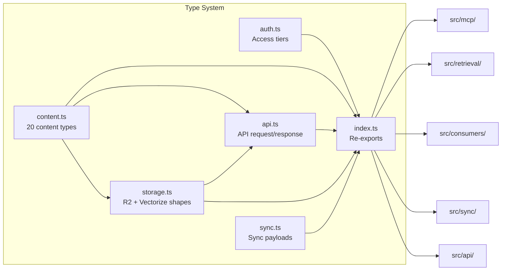

# Types

> Defines the entire type system: 20-type content ontology, auth model, API shapes, storage schemas, and sync payloads.

**Source:** `src/types/`
**Files:** 6 (`index.ts`, `content.ts`, `auth.ts`, `api.ts`, `storage.ts`, `sync.ts`)
**Spec reference:** `docs/spec.md` sections 2, 3, 4, 5, 6, 8
**Depends on:** none (leaf module)
**Depended on by:** `auth`, `retrieval`, `consumers`, `sync`, `mcp`, `api`, `index`

---

## Overview

The types directory is the foundation of the entire codebase. Every other module imports from it, and nothing imports into it. It defines Zod schemas that serve triple duty: runtime validation, TypeScript type inference, and OpenAPI documentation generation (via `@hono/zod-openapi`).

The type system models SuperBenefit's knowledge ontology — a 20-type hierarchy of content ranging from governance patterns and coordination protocols to people, groups, and events. This ontology is reflected in storage (R2 key paths, Vectorize metadata), search (filter schemas), and API responses.

All schemas use `@hono/zod-openapi`'s `.openapi()` extension to attach OpenAPI metadata, making them available in the auto-generated `/api/v1/openapi.json` spec.

## Data Flow Diagram

## File-by-File Reference

### `index.ts`

**Purpose:** Barrel file that re-exports all types, schemas, and helpers from the other five files.

#### Exports

All exports are re-exports. Organized into sections by spec reference:

| Section | Schemas | Types | Helpers |
|---------|---------|-------|---------|
| Content (spec 3) | `ContentTypeSchema`, `FileSchema`, `ResourceSchema`, `StorySchema`, `DataSchema`, `ReferenceSchema`, `ContentSchema`, + 14 concrete schemas | `ContentType`, `Content`, `FileFrontmatter`, + 14 concrete frontmatter types | `inferContentType`, `RESOURCE_TYPES`, `STORY_TYPES`, `REFERENCE_TYPES`, `DATA_TYPES`, `PATH_TYPE_MAP` |
| Auth (spec 2) | `AccessTierSchema`, `IdentitySchema`, `AuthContextSchema` | `AccessTier`, `Identity`, `AuthContext` | `TIER_LEVEL` |
| API (spec 6, 8) | `SearchFiltersSchema`, `ListParamsSchema`, `SearchParamsSchema`, `SearchResultSchema`, `RerankResultSchema`, `ErrorResponseSchema`, `EntryResponseSchema`, `EntryListResponseSchema`, `SearchResponseSchema` | `SearchFilters`, `ListParams`, `SearchParams`, `SearchResult`, `RerankResult`, `ErrorResponse` | |
| Storage (spec 4) | `R2DocumentSchema`, `VectorizeMetadataSchema` | `R2Document`, `VectorizeMetadata` | `truncateForMetadata`, `generateId`, `toR2Key`, `extractIdFromKey`, `extractContentTypeFromKey`, `VECTORIZE_LIMITS`, `VECTORIZE_NAMESPACE` |
| Sync (spec 5) | `SyncParamsSchema` | `SyncParams`, `R2EventNotification`, `GitHubPushEvent`, `ParsedMarkdown` | |

#### Dependencies
- **Internal:** `./content`, `./auth`, `./api`, `./storage`, `./sync`
- **External:** none

---

### `content.ts`

**Purpose:** Defines the 20-type content ontology as a Zod schema hierarchy with discriminated union.

#### Exports

| Export | Kind | Description |
|--------|------|-------------|
| `ContentTypeSchema` | Zod enum | All 20 content type literals |
| `ContentType` | Type | Inferred union type |
| `RESOURCE_TYPES` | Constant | `['pattern', 'practice', 'primitive', 'protocol', 'playbook', 'question']` |
| `STORY_TYPES` | Constant | `['study', 'article']` |
| `REFERENCE_TYPES` | Constant | `['index', 'link', 'tag']` |
| `DATA_TYPES` | Constant | `['person', 'group', 'project', 'place', 'gathering']` |
| `PATH_TYPE_MAP` | Record | Maps 17 path prefixes to content types |
| `inferContentType()` | Function | `(path: string) => ContentType` — falls back to `'file'` |
| `FileSchema` | Zod object | Base schema with `title`, `date`, `publish`, `draft`, etc. |
| `ResourceSchema` | Zod object | Extends `FileSchema` with `release`, `hasPart`, `isPartOf` |
| `StorySchema` | Zod object | Extends `FileSchema` with `release` |
| `DataSchema` | Zod object | Alias for `FileSchema` |
| `ReferenceSchema` | Zod object | Alias for `FileSchema` |
| `LinkSchema` | Zod object | Extends `ReferenceSchema` with `url` (required) |
| `TagSchema` | Zod object | Extends `ReferenceSchema` with `aliases`, `relatedTerms`, `category` |
| `PatternSchema` | Zod object | Extends `ResourceSchema` with `context`, `problem`, `solution`, `relatedPatterns` |
| `PracticeSchema` | Zod object | Extends `ResourceSchema` with `patterns`, `practitioners` |
| `PrimitiveSchema` | Zod object | Extends `ResourceSchema` with `category` |
| `ProtocolSchema` | Zod object | Extends `ResourceSchema` with `steps` |
| `PlaybookSchema` | Zod object | Alias for `ResourceSchema` |
| `QuestionSchema` | Zod object | Extends `ResourceSchema` with `status` (`open`/`exploring`/`resolved`), `related`, `proposedBy` |
| `StudySchema` | Zod object | Alias for `StorySchema` |
| `ArticleSchema` | Zod object | Extends `StorySchema` with `url`, `curator`, `harvester` |
| `PersonSchema` | Zod object | Extends `DataSchema` with `aliases`, `roles`, `groups`, `homepage`, `email`, `image` |
| `GroupSchema` | Zod object | Extends `DataSchema` with `aliases`, `members`, `homepage`, `logo` |
| `ProjectSchema` | Zod object | Extends `DataSchema` with `status` (`active`/`completed`/`paused`/`archived`), `lead`, `homepage` |
| `PlaceSchema` | Zod object | Extends `DataSchema` with `coordinates` (`{lat, lng}`), `region` |
| `GatheringSchema` | Zod object | Extends `DataSchema` with `eventDate`, `location`, `attendees`, `homepage` |
| `ContentSchema` | Discriminated union | Union of 16 concrete types, discriminated on `type` field |

#### Internal Logic

**Schema inheritance tree:**

```mermaid
graph TD
    FileSchema --> ReferenceSchema
    FileSchema --> ResourceSchema["ResourceSchema<br/>(+release, hasPart, isPartOf)"]
    FileSchema --> StorySchema["StorySchema<br/>(+release)"]
    FileSchema --> DataSchema

    ReferenceSchema --> LinkSchema["LinkSchema (+url)"]
    ReferenceSchema --> TagSchema["TagSchema (+aliases, relatedTerms)"]

    ResourceSchema --> PatternSchema["PatternSchema (+context, problem, solution)"]
    ResourceSchema --> PracticeSchema["PracticeSchema (+patterns, practitioners)"]
    ResourceSchema --> PrimitiveSchema["PrimitiveSchema (+category)"]
    ResourceSchema --> ProtocolSchema["ProtocolSchema (+steps)"]
    ResourceSchema --> PlaybookSchema
    ResourceSchema --> QuestionSchema["QuestionSchema (+status, related)"]

    StorySchema --> StudySchema
    StorySchema --> ArticleSchema["ArticleSchema (+url, curator)"]

    DataSchema --> PersonSchema["PersonSchema (+roles, groups, email)"]
    DataSchema --> GroupSchema["GroupSchema (+members, homepage)"]
    DataSchema --> ProjectSchema["ProjectSchema (+status, lead)"]
    DataSchema --> PlaceSchema["PlaceSchema (+coordinates)"]
    DataSchema --> GatheringSchema["GatheringSchema (+eventDate, location)"]
```

**`FileSchema` base fields** (all concrete types inherit these):
- `type` — optional ContentType (set explicitly in discriminated union)
- `title` — required, min 1 char
- `description` — optional string
- `date` — required, coerced to Date
- `publish` — boolean, defaults to `false`
- `draft` — boolean, defaults to `false`
- `permalink` — optional string
- `author` — optional string array
- `group` — optional string

**`PATH_TYPE_MAP`** maps repository directory prefixes to content types. Used by `inferContentType()` when frontmatter doesn't specify a `type` field. The mapping covers:
- `artifacts/patterns` → `pattern`, `artifacts/practices` → `practice`, etc.
- `data/people` → `person`, `data/groups` → `group`, etc.
- `links` → `link`, `tags` → `tag`
- `notes` / `drafts` → `file` (catch-all)

**`ContentSchema` discriminated union** includes 16 of the 20 types (excludes parent types `reference`, `resource`, `story`, `data` and the root `index` type as they are not standalone document types in the union).

#### Dependencies
- **External:** `@hono/zod-openapi` (Zod with OpenAPI extensions)

---

### `auth.ts`

**Purpose:** Defines the three-tier access control model for the porch framework.

#### Exports

| Export | Kind | Description |
|--------|------|-------------|
| `AccessTier` | Type | `'open' \| 'public' \| 'members'` |
| `AccessTierSchema` | Zod enum | Schema version of AccessTier |
| `TIER_LEVEL` | Record | Numeric ordering: `{ open: 0, public: 1, members: 2 }` |
| `Identity` | Interface | `{ userId, name, email, provider }` |
| `IdentitySchema` | Zod object | Schema for Identity |
| `AuthContext` | Interface | `{ identity: Identity \| null, tier: AccessTier }` |
| `AuthContextSchema` | Zod object | Schema for AuthContext |

#### Internal Logic

The three tiers represent increasing access levels:
- **open (0):** Anonymous, no auth required — Phase 1 default
- **public (1):** Authenticated via Cloudflare Access for SaaS — Phase 2
- **members (2):** Token-gated via Hats Protocol on Optimism — Phase 3

`TIER_LEVEL` provides numeric comparison: a request with tier level >= required tier level passes the access check. This is used by `checkTierAccess()` in `src/auth/check.ts`.

#### Dependencies
- **External:** `@hono/zod-openapi`

---

### `api.ts`

**Purpose:** Defines REST API request/response shapes for search, listing, and error handling.

#### Exports

| Export | Kind | Description |
|--------|------|-------------|
| `SearchFiltersSchema` | Zod object | Shared filter fields: `contentType`, `group`, `release`, `status`, `tags` |
| `SearchFilters` | Type | Inferred type |
| `ListParamsSchema` | Zod object | Pagination: `contentType`, `group`, `release`, `limit` (1-100, default 20), `offset` (min 0) |
| `ListParams` | Type | Inferred type |
| `SearchParamsSchema` | Zod object | Search: `q` (required), `contentType`, `group`, `release`, `limit` (1-20, default 5) |
| `SearchParams` | Type | Inferred type |
| `SearchResultSchema` | Zod object | Result: `id`, `contentType`, `title`, `description?`, `score`, `rerankScore?`, `document?` |
| `SearchResult` | Type | Inferred type |
| `RerankResultSchema` | Zod object | Reranked result: `id`, `score`, `rerankScore`, `metadata` (VectorizeMetadata) |
| `RerankResult` | Type | Inferred type |
| `ErrorResponseSchema` | Zod object | `{ error: { code, message } }` |
| `ErrorResponse` | Type | Inferred type |
| `EntryResponseSchema` | Zod object | `{ data: R2Document }` |
| `EntryListResponseSchema` | Zod object | `{ data: R2Document[], total, offset, limit }` |
| `SearchResponseSchema` | Zod object | `{ results: SearchResult[] }` |

#### Internal Logic

The `SearchFiltersSchema` is shared between REST API and MCP tools — both use the same filter vocabulary. The `tags` field accepts an array of strings, which maps to the comma-separated tags stored in Vectorize metadata via `$in` filter semantics.

#### Dependencies
- **Internal:** `./content` (ContentTypeSchema), `./storage` (R2DocumentSchema, VectorizeMetadataSchema)
- **External:** `@hono/zod-openapi`

---

### `storage.ts`

**Purpose:** Defines R2 document shape, Vectorize metadata schema, and helpers for ID generation and R2 key construction.

#### Exports

| Export | Kind | Signature | Description |
|--------|------|-----------|-------------|
| `VECTORIZE_LIMITS` | Constant | `{ METADATA_MAX_BYTES: 10240, VECTOR_ID_MAX_BYTES: 64, STRING_INDEX_MAX_BYTES: 64, TOP_K_WITH_METADATA: 20, TOP_K_WITHOUT_METADATA: 100, MAX_METADATA_INDEXES: 10 }` | Hard limits from Cloudflare Vectorize |
| `VECTORIZE_NAMESPACE` | Constant | `'superbenefit'` | Namespace for multi-tenant isolation |
| `R2DocumentSchema` | Zod object | | Document stored in R2 as JSON |
| `R2Document` | Type | | Inferred type |
| `VectorizeMetadataSchema` | Zod object | | Metadata attached to each vector |
| `VectorizeMetadata` | Type | | Inferred type |
| `truncateForMetadata` | Function | `(content: string) => string` | Truncate to 8000 chars at word boundary |
| `generateId` | Function | `(path: string) => string` | Extract filename stem, enforce 64-byte limit |
| `toR2Key` | Function | `(contentType, id) => string` | Build R2 key: `content/{type}/{id}.json` |
| `extractIdFromKey` | Function | `(key: string) => string` | Reverse of `toR2Key` for ID |
| `extractContentTypeFromKey` | Function | `(key: string) => ContentType` | Reverse of `toR2Key` for type |

#### Internal Logic

**`R2Document` shape:**
| Field | Type | Description |
|-------|------|-------------|
| `id` | string | Unique ID derived from filename (max 64 bytes) |
| `contentType` | ContentType | One of the 20 content types |
| `path` | string | Original GitHub repository path |
| `metadata` | `Record<string, unknown>` | Parsed YAML frontmatter |
| `content` | string | Markdown body (after frontmatter) |
| `syncedAt` | string (ISO datetime) | When the document was last synced |
| `commitSha` | string | Git commit SHA that triggered the sync |

**`VectorizeMetadata` shape** (must fit within 10 KiB per vector):

| Field | Type | Indexed | Description |
|-------|------|---------|-------------|
| `contentType` | string | Yes | Content type for filtering |
| `group` | string | Yes | Working group / cell |
| `tags` | string | Yes | Comma-separated tag list |
| `release` | string | Yes | Creative release identifier |
| `status` | string | Yes | Status (for questions, projects) |
| `date` | number | Yes | Unix timestamp in milliseconds |
| `path` | string | No | R2 object key for document fetch |
| `title` | string | No | Document title for display |
| `description` | string | No | Description for display |
| `content` | string | No | Truncated body for reranking (~8KB max) |

6 indexed fields out of the Vectorize maximum of 10.

**`truncateForMetadata()`** clips content to 8000 characters at the nearest word boundary, appending `...` if truncated. This leaves approximately 2 KiB for the other metadata fields within the 10 KiB limit.

**`generateId()`** extracts the filename without extension from a path (e.g., `artifacts/patterns/cell-governance.md` → `cell-governance`). Throws if the resulting ID exceeds 64 bytes (Vectorize limit).

**R2 key convention:** `content/{contentType}/{id}.json` — e.g., `content/pattern/cell-governance.json`. This allows both individual lookups and prefix-based listing by content type.

#### Dependencies
- **Internal:** `./content` (ContentTypeSchema, ContentType)
- **External:** `@hono/zod-openapi`

---

### `sync.ts`

**Purpose:** Defines payload types for the sync pipeline: workflow params, R2 events, GitHub webhooks, and parsed markdown.

#### Exports

| Export | Kind | Description |
|--------|------|-------------|
| `SyncParamsSchema` | Zod object | Workflow input: `{ changedFiles: string[], deletedFiles: string[], commitSha: string }` |
| `SyncParams` | Type | Inferred type |
| `R2EventNotification` | Interface | R2 bucket event: `{ account, bucket, object: { key, size, eTag }, eventType, eventTime }` |
| `GitHubPushEvent` | Interface | Subset of GitHub push webhook: `{ ref, after, commits: [{ added, modified, removed }] }` |
| `ParsedMarkdown` | Interface | `{ frontmatter: Record<string, unknown>, body: string }` |

#### Internal Logic

`R2EventNotification.eventType` is limited to `'object-create' | 'object-delete'` — these are the only events the queue consumer handles.

`GitHubPushEvent` captures only the fields used by `handleWebhook()`: `ref` for branch filtering, `after` for the commit SHA, and `commits` for file change lists.

#### Dependencies
- **External:** `@hono/zod-openapi`

---

## Key Types

| Type | Owner | Used By | Description |
|------|-------|---------|-------------|
| `ContentType` | `content.ts` | Everything | Union of 20 content type strings |
| `R2Document` | `storage.ts` | `sync`, `consumers`, `retrieval`, `mcp`, `api` | The canonical document stored in R2 |
| `VectorizeMetadata` | `storage.ts` | `consumers`, `retrieval` | Metadata attached to vectors |
| `AuthContext` | `auth.ts` | `auth`, `mcp` | Resolved access context for a request |
| `SearchResult` | `api.ts` | `retrieval`, `mcp`, `api` | Search result returned to clients |
| `RerankResult` | `api.ts` | `retrieval` | Internal reranked result shape |
| `SyncParams` | `sync.ts` | `sync` | Workflow input payload |

## Configuration and Limits

| Constant | Value | Source |
|----------|-------|--------|
| `VECTORIZE_LIMITS.METADATA_MAX_BYTES` | 10,240 (10 KiB) | Cloudflare Vectorize |
| `VECTORIZE_LIMITS.VECTOR_ID_MAX_BYTES` | 64 | Cloudflare Vectorize |
| `VECTORIZE_LIMITS.TOP_K_WITH_METADATA` | 20 | Cloudflare Vectorize |
| `VECTORIZE_LIMITS.TOP_K_WITHOUT_METADATA` | 100 | Cloudflare Vectorize |
| `VECTORIZE_LIMITS.MAX_METADATA_INDEXES` | 10 | Cloudflare Vectorize |
| `VECTORIZE_NAMESPACE` | `'superbenefit'` | Application config |
| `MAX_CONTENT_LENGTH` (internal) | 8,000 | Leaves ~2 KiB for other metadata fields |

## Extension Points

**Adding a new content type:**
1. Add the type literal to `ContentTypeSchema` enum in `content.ts`
2. Create a concrete schema extending the appropriate parent (`ResourceSchema`, `StorySchema`, etc.)
3. Add the type to the relevant `*_TYPES` array
4. Add a path prefix mapping to `PATH_TYPE_MAP`
5. Add the schema to the `ContentSchema` discriminated union
6. Export the schema and type from `index.ts`

**Adding a new Vectorize metadata field:**
1. Add the field to `VectorizeMetadataSchema` in `storage.ts`
2. If indexed, count total indexed fields (max 10) and create the index via `wrangler vectorize create-metadata-index`
3. Update `updateVectorize()` in `src/consumers/vectorize.ts` to populate the field
4. Ensure total metadata stays under 10 KiB

## Cross-References

- [auth.md](auth.md) — How `AccessTier` and `AuthContext` are used for access control
- [retrieval.md](retrieval.md) — How `SearchFilters`, `SearchResult`, and `VectorizeMetadata` drive search
- [consumers.md](consumers.md) — How `R2Document` is transformed into `VectorizeMetadata`
- [sync.md](sync.md) — How `SyncParams` and `ParsedMarkdown` drive the sync pipeline
- `docs/spec.md` sections 2-8 — Full specification for each type category
