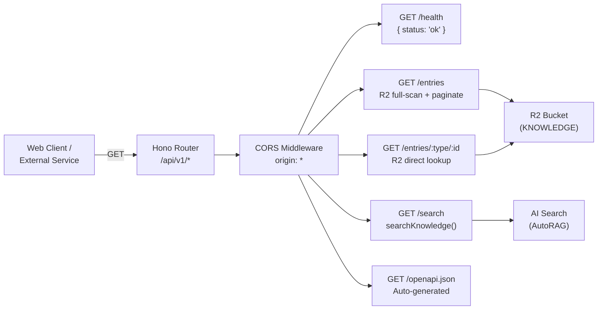

# API

> Public read-only REST API built with Hono + OpenAPI, providing entry listing, single entry retrieval, and semantic search.

**Source:** `src/api/`
**Files:** 2 (`routes.ts`, `schemas.ts`)
**Spec reference:** `docs/spec.md` sections 8, 10 (v0.16)
**Depends on:** `types` (`ContentTypeSchema`, `ListParamsSchema`, `SearchParamsSchema`, response schemas), `retrieval` (`searchKnowledge`), `types/storage` (`toR2Key`, `R2Document`)
**Depended on by:** `index` (mounted at `/api/v1` via Hono routing)

---

## Overview

The API module provides a public REST API for the knowledge base, designed for web frontends and external integrations that don't use MCP. It exposes four routes plus an auto-generated OpenAPI spec, all read-only, all unauthenticated (Phase 1).

The API is built with `@hono/zod-openapi`, which combines Hono's routing with Zod schema validation and automatic OpenAPI 3.1 document generation. Route parameters and responses are validated at runtime and documented in the generated spec at `/api/v1/openapi.json`.

CORS is configured for universal access (`origin: '*'`, GET/HEAD/OPTIONS only). All GET responses include cache headers (`public, max-age=300, stale-while-revalidate=3600`) for CDN and browser caching.

## Data Flow Diagram

## File-by-File Reference

### `routes.ts`

**Purpose:** Defines the Hono app with three API routes and the OpenAPI spec endpoint.

#### Exports

| Export | Kind | Signature | Description |
|--------|------|-----------|-------------|
| `api` | `OpenAPIHono` instance | `OpenAPIHono<{ Bindings: Env }>` | The Hono app, mounted by `src/index.ts` at `/api/v1` |

#### Internal Logic

**App setup:**
- Uses `OpenAPIHono` (not plain `Hono`) for automatic OpenAPI generation
- Global error handler returns `{ error: { code: 'INTERNAL_ERROR', message: '...' } }` with 500 status
- CORS middleware: `origin: '*'`, methods: `GET, HEAD, OPTIONS`, headers: `Content-Type, Accept`, max-age: 86400 (24h preflight cache)
- Cache headers constant: `Cache-Control: public, max-age=300, stale-while-revalidate=3600`

---

**`GET /health` — Health check**

Returns `{ status: 'ok' }` with 200 status. No cache headers, no binding access — pure liveness check for ops monitoring.

---

**`GET /entries` — List/filter entries**

Query parameters (validated by `ListQuerySchema`):
| Param | Type | Default | Description |
|-------|------|---------|-------------|
| `contentType` | ContentType | (none) | Filter by content type |
| `group` | string | (none) | Filter by group metadata |
| `release` | string | (none) | Filter by release metadata |
| `limit` | number | 20 | Page size (1-100) |
| `offset` | number | 0 | Pagination offset |

Response: `{ data: R2Document[], total: number, offset: number, limit: number }`

---

**`GET /entries/{contentType}/{id}` — Single entry**

Path parameters (validated by `EntryParamsSchema`):
| Param | Type | Description |
|-------|------|-------------|
| `contentType` | ContentType | Content type |
| `id` | string (min 1) | Document ID |

Responses:
- 200: `{ data: R2Document }`
- 404: `{ error: { code: 'NOT_FOUND', message: 'Entry {type}/{id} not found' } }`

---

**`GET /search` — Semantic search**

Query parameters (validated by `SearchQuerySchema`):
| Param | Type | Default | Description |
|-------|------|---------|-------------|
| `q` | string (required) | | Search query |
| `contentType` | ContentType | (none) | Filter by content type |
| `group` | string | (none) | Filter by group |
| `release` | string | (none) | Filter by release |
| `limit` | number | 5 | Max results (1-20) |

Response: `{ results: SearchResult[] }`

Delegates to `searchKnowledge()` which uses AI Search (AutoRAG) to search R2 content directly.

---

**`GET /openapi.json` — OpenAPI spec**

Auto-generated by `@hono/zod-openapi` from route definitions and Zod schemas.

#### Dependencies
- **Internal:** `./schemas`, `../types/storage` (toR2Key, R2Document), `../retrieval` (searchKnowledge)
- **External:** `@hono/zod-openapi` (OpenAPIHono, createRoute), `hono/cors`

---

### `schemas.ts`

**Purpose:** Route-level parameter schemas and re-exports of response schemas for OpenAPI generation.

Schemas are re-exported from `@superbenefit/knowledge-schemas` with OpenAPI annotations added where needed. `EntryParamsSchema` adds path parameter metadata.

#### Dependencies
- **Internal:** `../types/content` (ContentTypeSchema), `../types/api` (ListParamsSchema, SearchParamsSchema, response schemas)
- **External:** `@hono/zod-openapi`

---

## Cloudflare Bindings Used

| Binding | Type | Usage |
|---------|------|-------|
| `KNOWLEDGE` | `R2Bucket` | List entries, get entries |
| `AI` | `Ai` | Via `searchKnowledge()` — AI Search (AutoRAG) |

## Configuration and Limits

| Setting | Value | Source |
|---------|-------|--------|
| CORS origin | `*` | `routes.ts` |
| CORS methods | `GET, HEAD, OPTIONS` | `routes.ts` |
| CORS preflight max-age | 86400 (24h) | `routes.ts` |
| Cache-Control | `public, max-age=300, stale-while-revalidate=3600` | `routes.ts` |
| List limit range | 1-100 (default 20) | `types/api.ts` |
| Search limit range | 1-20 (default 5) | `types/api.ts` |
| R2 list page size | 1000 (Cloudflare max) | `routes.ts` |

## Error Handling

| Failure | Response |
|---------|----------|
| Validation error (bad params) | 400 with Zod error details (via `@hono/zod-openapi`) |
| Entry not found | 404: `{ error: { code: 'NOT_FOUND', message: '...' } }` |
| Unhandled exception | 500: `{ error: { code: 'INTERNAL_ERROR', message: 'An unexpected error occurred' } }` |
| CORS preflight | 204 with appropriate headers (via Hono CORS middleware) |

## Cross-References

- [types](../types/) — `ListParams`, `SearchParams`, `SearchResult`, `R2Document`, `ErrorResponse`
- [retrieval](../retrieval/) — `searchKnowledge()` using AI Search (AutoRAG)
- [index](../) — Where the API is mounted at `/api/v1`
- `docs/spec.md` sections 8, 10 (v0.16) — REST API and error handling specification
