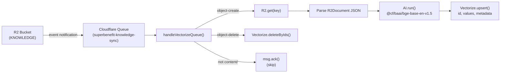

# Consumers

> Processes R2 bucket event notifications via a queue consumer to keep Vectorize in sync with stored content.

**Source:** `src/consumers/`
**Files:** 1 (`vectorize.ts`)
**Spec reference:** `docs/spec.md` sections 4.3-4.4, 5.3
**Depends on:** `types` (`VectorizeMetadata`, `R2Document`, `extractIdFromKey`, `truncateForMetadata`, `toR2Key`, `VECTORIZE_NAMESPACE`)
**Depended on by:** `index` (exports `handleVectorizeQueue` for the worker's `queue` handler)

---

## Overview

The consumers directory contains a single queue consumer that bridges R2 storage and Vectorize search. When the sync workflow writes or deletes a document in R2, the R2 bucket emits an event notification to a Cloudflare Queue. This consumer processes those events, generating embeddings for new/updated documents and removing vectors for deleted ones.

This is the write-side counterpart to the [retrieval module](../retrieval/)'s read-side search pipeline. Together they form a complete index: sync writes to R2, R2 events trigger this consumer, the consumer writes to Vectorize, and the retrieval module reads from Vectorize.

The consumer is designed for idempotency — upserting the same document ID overwrites the previous vector, and deleting a non-existent ID is a no-op. This is critical because R2 event notifications have no ordering guarantee.

## Data Flow Diagram



## File-by-File Reference

### `vectorize.ts`

**Purpose:** Queue consumer that processes R2 event notifications to update the Vectorize index.

#### Exports

| Export | Kind | Signature | Description |
|--------|------|-----------|-------------|
| `handleVectorizeQueue` | Async function | `(batch: MessageBatch<R2EventNotification>, env: ConsumerDeps) => Promise<void>` | Main queue handler |
| `updateVectorize` | Async function | `(doc: R2Document, env: Pick<ConsumerDeps, 'AI' \| 'VECTORIZE'>) => Promise<void>` | Upsert a document into Vectorize |
| `deleteFromVectorize` | Async function | `(id: string, env: Pick<ConsumerDeps, 'VECTORIZE'>) => Promise<void>` | Delete a vector by ID |

#### Internal Logic

**`handleVectorizeQueue()`:**

Iterates through each message in the batch sequentially. For each message:

1. **Prefix filter:** Checks if `object.key` starts with `content/`. Non-content objects (e.g., metadata files) are acknowledged and skipped.
2. **Create events (`object-create`):**
   - Fetches the R2 object by key
   - If the object is gone (deleted between event and processing), acknowledges and skips
   - Parses the R2 object as `R2Document` JSON
   - Calls `updateVectorize()` to embed and upsert
3. **Delete events (`object-delete`):**
   - Extracts the document ID from the R2 key using `extractIdFromKey()`
   - Calls `deleteFromVectorize()` to remove the vector
4. **Acknowledgment:** `msg.ack()` is called per-message on success. On failure, the message is NOT acknowledged, so the queue will retry it.

**Per-message `msg.ack()` is critical.** The codebase explicitly avoids `batch.ackAll()` — if one message fails, only that message should be retried, not the entire batch.

**`updateVectorize()`:**

1. **Build embedding input:** Concatenates `title`, `description`, and `content` body (filtered for truthy values, joined with double newlines)
2. **Generate embedding:** Calls `@cf/baai/bge-base-en-v1.5` via Workers AI, producing a 768-dimensional vector
3. **Build metadata:** Constructs a `VectorizeMetadata` object with:
   - 6 indexed fields: `contentType`, `group`, `tags` (comma-joined from array), `release`, `status`, `date` (Unix timestamp ms)
   - 4 non-indexed fields: `path` (R2 key), `title`, `description`, `content` (truncated to ~8KB via `truncateForMetadata()`)
4. **Upsert:** Calls `VECTORIZE.upsert()` with the vector ID, values, metadata, and namespace

**Metadata construction details:**
- `tags` are serialized as a comma-separated string because Vectorize metadata values must be scalar. The search module uses `$in` filter semantics to match.
- `date` is stored as a Unix timestamp (milliseconds) for numeric range filtering.
- `content` is truncated to ~8000 characters at a word boundary to stay within the 10 KiB metadata limit while leaving room for other fields.
- Missing optional fields default to empty string `''` or `0` for date.

**`deleteFromVectorize()`:**
- Calls `VECTORIZE.deleteByIds([id])` — idempotent, no error on missing IDs.

#### Internal Types

**`R2EventNotification`** (defined locally, mirrors `types/sync.ts`):
```typescript
interface R2EventNotification {
  account: string;
  bucket: string;
  object: { key: string; size: number; eTag: string };
  eventType: 'object-create' | 'object-delete';
  eventTime: string;
}
```

**`ConsumerDeps`** (dependency injection interface):
```typescript
interface ConsumerDeps {
  KNOWLEDGE: R2Bucket;
  VECTORIZE: VectorizeIndex;
  AI: Ai;
}
```

The `ConsumerDeps` interface abstracts bindings for testability. `updateVectorize()` and `deleteFromVectorize()` accept `Pick<>` subsets to declare their minimum requirements.

#### Dependencies
- **Internal:** `../types/storage` (extractIdFromKey, truncateForMetadata, toR2Key, VECTORIZE_NAMESPACE), `../types` (VectorizeMetadata, R2Document)
- **External:** Cloudflare Workers AI (`env.AI`), Cloudflare Vectorize (`env.VECTORIZE`), Cloudflare R2 (`env.KNOWLEDGE`)

---

## Key Types

| Type | Source | Description |
|------|--------|-------------|
| `R2Document` | `types/storage.ts` | Document read from R2, input to `updateVectorize()` |
| `VectorizeMetadata` | `types/storage.ts` | Metadata attached to each vector (10 fields, 6 indexed) |
| `R2EventNotification` | `vectorize.ts` (local) | R2 bucket event payload |
| `ConsumerDeps` | `vectorize.ts` (local) | Binding interface for dependency injection |

See [types](../types/) for full schema definitions.

## Cloudflare Bindings Used

| Binding | Type | Usage |
|---------|------|-------|
| `KNOWLEDGE` | `R2Bucket` | Fetch document JSON on create events |
| `AI` | `Ai` | Generate BGE embeddings for documents |
| `VECTORIZE` | `VectorizeIndex` | Upsert and delete vectors |

## Configuration and Limits

| Setting | Value | Source |
|---------|-------|--------|
| Queue name | `superbenefit-knowledge-sync` | `wrangler.jsonc` |
| Max batch size | 10 | `wrangler.jsonc` |
| Max batch timeout | 30 seconds | `wrangler.jsonc` |
| Embedding model | `@cf/baai/bge-base-en-v1.5` | Application code |
| Vectorize namespace | `'superbenefit'` | `VECTORIZE_NAMESPACE` constant |
| Content prefix | `content/` | Application code |
| Max metadata content | 8,000 chars | `truncateForMetadata()` in `types/storage.ts` |

## Error Handling

| Failure | Behavior |
|---------|----------|
| R2 object missing on create | Acknowledged and skipped (object deleted between event and processing) |
| Embedding generation fails | Exception logged, message NOT acknowledged (queue retries) |
| Vectorize upsert fails | Exception logged, message NOT acknowledged (queue retries) |
| Vectorize delete fails | Exception logged, message NOT acknowledged (queue retries) |
| Non-content/ key | Acknowledged and skipped (not our concern) |

The error logging includes the message ID for debugging:
```
Failed to process queue message {msg.id}: {error.message}
```

## Extension Points

**Adding new indexed metadata fields:**
1. Add the field to `VectorizeMetadataSchema` in `types/storage.ts`
2. Populate it in the metadata construction block of `updateVectorize()`
3. Create the metadata index: `wrangler vectorize create-metadata-index superbenefit-knowledge-idx --property-name=fieldName --type=string`
4. Count total indexed fields (max 10; currently 6)

**Processing additional event types:**
1. Extend the `eventType` union in `R2EventNotification`
2. Add a new branch in the event processing loop in `handleVectorizeQueue()`

## Cross-References

- [types](../types/) — `R2Document`, `VectorizeMetadata` schemas
- [retrieval](../retrieval/) — The read-side counterpart that queries the Vectorize index
- [sync](../sync/) — The workflow that writes to R2, triggering the events this consumer processes
- [index](../) — Where `handleVectorizeQueue` is wired to the worker's `queue` export
- `docs/spec.md` sections 4.3-4.4, 5.3 — Vectorize indexing and event processing specification
