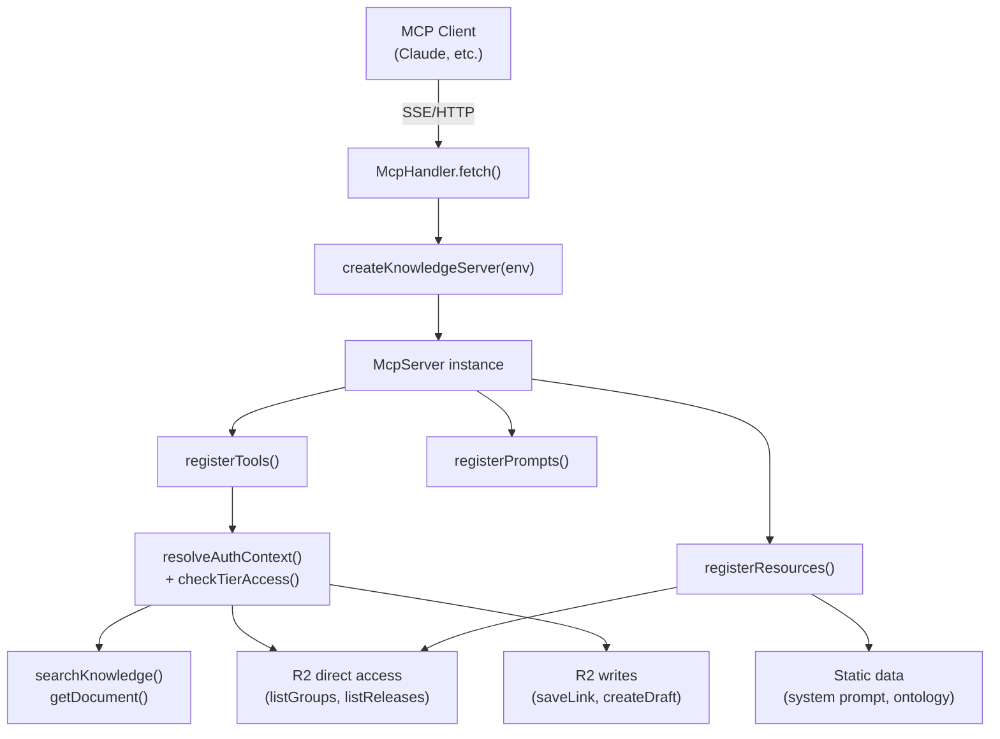

# MCP

> Implements the Model Context Protocol server with 10 tools, 4 resources, and 3 prompts for AI-assisted knowledge base access.

**Source:** `src/mcp/`
**Files:** 5 (`index.ts`, `server.ts`, `tools.ts`, `resources.ts`, `prompts.ts`)
**Spec reference:** `docs/spec.md` sections 7.3-7.5
**Depends on:** `types`, `auth` (`resolveAuthContext`, `checkTierAccess`), `retrieval` (`searchKnowledge`, `getDocument`)
**Depended on by:** `index` (routes `/mcp` requests to `McpHandler`)

---

## Overview

The MCP module exposes the knowledge base to AI clients via the Model Context Protocol. It provides three categories of primitives: **tools** (callable functions for search, lookup, and content creation), **resources** (read-only context data like system prompts and ontology documentation), and **prompts** (workflow templates for common research tasks).

The server uses a stateless architecture — a new `McpServer` instance is created for each request via `createMcpHandler` from the `agents/mcp` package. No state persists between requests (no Durable Object). This means every tool, resource, and prompt is re-registered on each invocation, but the overhead is negligible compared to the AI model calls.

Every tool follows the porch access control pattern: call `resolveAuthContext()`, call `checkTierAccess()`, return an error if denied, proceed if allowed. In Phase 1, all tools are open tier, but the guard pattern is in place for Phase 3 when some tools will require members access.

## Data Flow Diagram



## File-by-File Reference

### `index.ts`

**Purpose:** Barrel file re-exporting all MCP module components.

#### Exports

| Export | Kind | Source |
|--------|------|--------|
| `McpHandler` | Object | `./server` |
| `createKnowledgeServer` | Function | `./server` |
| `registerTools` | Function | `./tools` |
| `listGroups` | Function | `./tools` |
| `listReleases` | Function | `./tools` |
| `registerResources` | Function | `./resources` |
| `registerPrompts` | Function | `./prompts` |

---

### `server.ts`

**Purpose:** Creates and configures the stateless MCP handler.

#### Exports

| Export | Kind | Signature | Description |
|--------|------|-----------|-------------|
| `McpHandler` | Object | `{ fetch(request, env, ctx): Promise<Response> }` | Stateless request handler |
| `createKnowledgeServer` | Function | `(env: Env) => McpServer` | Factory for configured server instances |

#### Internal Logic

**`createKnowledgeServer()`:**
1. Creates a new `McpServer` with name `superbenefit-knowledge` and version `1.0.0`
2. Calls `registerTools(server, env)`, `registerResources(server, env)`, `registerPrompts(server, env)`
3. Returns the fully configured server

**`McpHandler.fetch()`:**
1. Creates a new server instance via `createKnowledgeServer(env)` — per-request, no shared state
2. Wraps it with `createMcpHandler()` from `agents/mcp`, configured with:
   - `route: '/mcp'` — path prefix for MCP endpoints
   - CORS: `origin: '*'`, methods: `GET, POST, DELETE, OPTIONS`, headers: `Content-Type, Authorization, Mcp-Session-Id`
3. Delegates the request to the handler

**Why `Mcp-Session-Id` in CORS headers:** MCP's Streamable HTTP transport uses this header for session management. Without it in `Access-Control-Allow-Headers`, browser-based MCP clients would fail CORS preflight.

#### Dependencies
- **Internal:** `./tools`, `./resources`, `./prompts`
- **External:** `@modelcontextprotocol/sdk/server/mcp.js` (McpServer), `agents/mcp` (createMcpHandler)

---

### `tools.ts`

**Purpose:** Registers all 10 MCP tools with the porch access control guard pattern.

#### Exports

| Export | Kind | Signature | Description |
|--------|------|-----------|-------------|
| `registerTools` | Function | `(server: McpServer, env: Env) => void` | Register all tools on a server instance |
| `listGroups` | Function | `(env: Env) => Promise<Array<...>>` | List groups from R2 (shared with resources) |
| `listReleases` | Function | `(env: Env) => Promise<Array<...>>` | List releases from R2 (shared with resources) |

#### Tool Catalog

| Tool | Parameters | Phase 1 Tier | Phase 3 Tier | Description |
|------|-----------|-------------|-------------|-------------|
| `search_knowledge` | `query: string`, `filters?: { contentType?, group?, release? }` | open | open | Semantic search across the knowledge base |
| `define_term` | `term: string` | open | open | Look up a term definition from the lexicon (tags) |
| `search_lexicon` | `keyword: string` | open | open | Search lexicon entries by keyword |
| `list_groups` | (none) | open | open | List all groups/cells |
| `list_releases` | (none) | open | open | List creative releases |
| `get_document` | `contentType: ContentType`, `id: string` | open | **members** | Get full document by type and ID |
| `search_with_documents` | `query: string`, `filters?: SearchFilters` | open | **members** | Search with full document content in results |
| `save_link` | `url: string`, `title: string`, `description?: string` | open | **members** | Save a new link (as draft) |
| `create_draft` | `contentType: ContentType`, `title: string`, `content: string` | open | **members** | Create a new draft document |

**Note:** 5 tools are permanently open tier. 4 tools will become members-only in Phase 3 (marked with comments `// Phase 1: 'open'; Phase 3: change to 'members'`). The `search_knowledge` tool was not annotated for Phase 3, implying it stays open.

#### Helper Functions (internal to module)

| Function | Signature | Description |
|----------|-----------|-------------|
| `getTermDefinition` | `(term, env) => Promise<string \| null>` | Looks up a tag by converting term to lowercase-hyphenated ID |
| `searchLexicon` | `(keyword, env) => Promise<Array<{ term, description }>>` | Searches with `contentType: 'tag'` filter |
| `listGroups` | `(env) => Promise<Array<{ id, title, description? }>>` | Lists R2 objects with `content/group/` prefix |
| `listReleases` | `(env) => Promise<Array<{ id, title, description? }>>` | Scans all R2 content for unique `release` metadata values |
| `saveLink` | `(params, authorId, env) => Promise<void>` | Creates a link document in R2 with `publish: false, draft: true` |
| `createDraft` | `(params, authorId, env) => Promise<R2Document>` | Creates a draft document in R2 |

**`listGroups()` performance note:** Iterates all objects under `content/group/` prefix and fetches each one. For large numbers of groups, this does N+1 R2 calls (1 list + N gets). Acceptable for the current scale.

**`listReleases()` performance note:** Scans ALL objects under `content/` and reads each to find unique `release` metadata values. This is an O(N) full scan. A future optimization would store releases as a separate index.

**`saveLink()` and `createDraft()` details:**
- Both set `publish: false` and `draft: true` — content is not immediately searchable
- Both use `authContext.identity?.userId || 'anonymous'` for the author
- Both generate IDs from the title (lowercased, spaces to hyphens)
- `saveLink()` uses commit SHA `'user-submitted'`; `createDraft()` uses `'user-draft'`

#### Guard Pattern (applied to every tool)

```typescript
const authContext = await resolveAuthContext(env);
const access = checkTierAccess('open', authContext);  // or 'members' in Phase 3
if (!access.allowed) {
  return {
    content: [{ type: 'text', text: `Requires ${access.requiredTier} access. Current: ${access.currentTier}.` }],
    isError: true,
  };
}
```

#### Dependencies
- **Internal:** `../types` (ContentTypeSchema, SearchFiltersSchema, ContentType, R2Document), `../retrieval` (searchKnowledge, getDocument), `../types/storage` (toR2Key, generateId), `../auth/resolve`, `../auth/check`

---

### `resources.ts`

**Purpose:** Registers 4 MCP resources providing read-only context data.

#### Exports

| Export | Kind | Signature | Description |
|--------|------|-----------|-------------|
| `registerResources` | Function | `(server: McpServer, env: Env) => void` | Register all resources |

#### Resource Catalog

| Resource | URI | MIME Type | Description |
|----------|-----|-----------|-------------|
| `prompts/knowledge-search` | `mcp://superbenefit/prompts/knowledge-search` | `text/plain` | System prompt for knowledge search — instructions for AI clients on how to use the tools |
| `data/ontology` | `mcp://superbenefit/data/ontology` | `application/json` | Content type hierarchy and metadata schema documentation |
| `data/groups` | `mcp://superbenefit/data/groups` | `application/json` | List of groups/cells (dynamic, from R2) |
| `data/releases` | `mcp://superbenefit/data/releases` | `application/json` | List of releases (dynamic, from R2) |

**System prompt content** covers:
- SuperBenefit DAO context
- Instructions for using `search_knowledge` and `define_term`
- Brief descriptions of all content types
- Guidance on citing sources and distinguishing documented practices from general knowledge

**Ontology schema** includes:
- Version (`0.11`)
- Content type list (from `ContentTypeSchema.options`)
- Hierarchy tree (file → reference/resource/story/data → concrete types)
- Metadata field documentation (required, optional, indexed)

**URI scheme:** All resources use `mcp://superbenefit/` as the URI prefix. This is a custom MCP URI scheme, not a standard URL.

#### Dependencies
- **Internal:** `./tools` (listGroups, listReleases), `../types/content` (ContentTypeSchema, RESOURCE_TYPES, STORY_TYPES, REFERENCE_TYPES, DATA_TYPES)
- **External:** `@modelcontextprotocol/sdk/server/mcp.js`

---

### `prompts.ts`

**Purpose:** Registers 3 MCP prompt templates for common research workflows.

#### Exports

| Export | Kind | Signature | Description |
|--------|------|-----------|-------------|
| `registerPrompts` | Function | `(server: McpServer, _env: Env) => void` | Register all prompts |

#### Prompt Catalog

| Prompt | Parameters | Description |
|--------|-----------|-------------|
| `research-topic` | `topic: string`, `depth?: 'shallow' \| 'deep'` | Research a topic comprehensively; shallow mode gives brief summary, deep mode provides full analysis with gaps |
| `explain-pattern` | `pattern: string` | Explain a DAO pattern with definition, practice examples, related patterns, and when to use |
| `compare-practices` | `practice1: string`, `practice2: string` | Compare two governance/coordination approaches on similarities, differences, and complementarity |

All prompts return a single user message instructing the AI to use `search_knowledge` and `define_term` tools. They do not call tools themselves — they provide structured instructions that the AI client follows.

The `_env` parameter is accepted but unused (prompts are static text templates).

#### Dependencies
- **External:** `@modelcontextprotocol/sdk/server/mcp.js`, `zod`

---

## Key Types

| Type | Source | Description |
|------|--------|-------------|
| `McpServer` | `@modelcontextprotocol/sdk` | Server instance for registering tools/resources/prompts |
| `ContentType` | `types/content.ts` | Used in tool parameters |
| `R2Document` | `types/storage.ts` | Returned by get/search tools |
| `SearchFilters` | `types/api.ts` | Used in search tool filters |
| `AuthContext` | `types/auth.ts` | Result of `resolveAuthContext()` |

## Cloudflare Bindings Used

| Binding | Type | Usage |
|---------|------|-------|
| `AI` | `Ai` | Via `searchKnowledge()` — embedding and reranking |
| `VECTORIZE` | `VectorizeIndex` | Via `searchKnowledge()` — similarity search |
| `KNOWLEDGE` | `R2Bucket` | Document fetch, group listing, release listing, link/draft creation |
| `RERANK_CACHE` | `KVNamespace` | Via `searchKnowledge()` — reranker cache |

## Configuration and Limits

| Setting | Value | Source |
|---------|-------|--------|
| Server name | `superbenefit-knowledge` | `server.ts` |
| Server version | `1.0.0` | `server.ts` |
| MCP route | `/mcp` | `server.ts` |
| CORS origin | `*` | `server.ts` |
| CORS headers | `Content-Type, Authorization, Mcp-Session-Id` | `server.ts` |

## Error Handling

All tools follow the same error pattern:

| Failure | Behavior |
|---------|----------|
| Access denied | Returns `{ isError: true, content: "Requires X access." }` |
| Document not found | Returns `{ isError: true, content: "Document not found" }` |
| Term not found | Returns `{ content: 'Term "X" not found in lexicon.' }` (not `isError`) |
| Search/retrieval error | Exception propagates to MCP SDK, which returns an error response |

## Extension Points

**Adding a new MCP tool:**
1. Add the tool registration in `registerTools()` in `tools.ts`
2. Follow the guard pattern: `resolveAuthContext()` → `checkTierAccess()` → logic
3. Choose the appropriate tier (`'open'` for Phase 1, annotate for future phases)
4. Update the tool count in `server.ts` comment

**Adding a new MCP resource:**
1. Add the resource registration in `registerResources()` in `resources.ts`
2. Use the `mcp://superbenefit/` URI prefix
3. Choose appropriate MIME type (`text/plain` or `application/json`)

**Adding a new MCP prompt:**
1. Add the prompt registration in `registerPrompts()` in `prompts.ts`
2. Define parameters with Zod schemas
3. Return user messages that instruct the AI to use available tools

**Phase 3 — upgrading tool tiers:**
1. In `tools.ts`, change `checkTierAccess('open', ...)` to `checkTierAccess('members', ...)` for the 4 marked tools
2. No other changes needed

## Cross-References

- [auth](../auth/) — Porch access control guard pattern
- [retrieval](../retrieval/) — `searchKnowledge()` pipeline called by search tools
- [types](../types/) — `ContentType`, `SearchFilters`, `R2Document` schemas
- [index](../) — Routing `/mcp` to `McpHandler`
- `CLAUDE.md` — Guard boilerplate snippet
- `docs/spec.md` sections 7.3-7.5 — Full MCP primitive specifications
