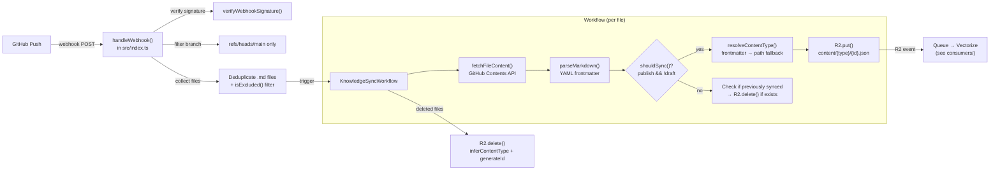

# Sync

> Syncs markdown content from GitHub to R2 via a Cloudflare Workflow, with webhook verification, file fetching, and frontmatter parsing.

**Source:** `src/sync/`
**Files:** 3 (`workflow.ts`, `github.ts`, `parser.ts`)
**Spec reference:** `docs/spec.md` section 5
**Depends on:** `types` (`SyncParams`, `ContentType`, `R2Document`, `inferContentType`, `generateId`, `toR2Key`, `ContentTypeSchema`, `FileSchema`, `ParsedMarkdown`)
**Depended on by:** `index` (webhook handler triggers workflow, re-exports `KnowledgeSyncWorkflow`)

---

## Overview

The sync module handles the pipeline from GitHub push events to R2 document storage. When a contributor pushes markdown files to the knowledge repository on GitHub, a webhook fires, the entry point validates and triggers a Cloudflare Workflow, and the workflow fetches, parses, and stores each file.

The sync pipeline is selective — only published, non-draft markdown files are stored in R2. Files that fail the publish gate but were previously stored are cleaned up (deleted from R2). This means "unpublishing" a document by changing `publish: false` in frontmatter will remove it from the knowledge base.

The workflow uses Cloudflare's built-in retry mechanism with exponential backoff for transient failures (rate limits, server errors), while permanent failures like 404s are marked non-retryable.

## Data Flow Diagram



## File-by-File Reference

### `workflow.ts`

**Purpose:** Cloudflare Workflow that processes changed and deleted markdown files from GitHub.

#### Exports

| Export | Kind | Signature | Description |
|--------|------|-----------|-------------|
| `KnowledgeSyncWorkflow` | Class | `extends WorkflowEntrypoint<Env, SyncParams>` | Workflow class discovered by wrangler |

#### Internal Logic

The workflow receives a `SyncParams` payload containing `changedFiles`, `deletedFiles`, and `commitSha`.

**Changed files processing** — each file gets its own workflow step (`sync-{filePath}`):

1. **Retry policy:** 5 retries, 30-second initial delay, exponential backoff, 2-minute timeout per step
2. **Fetch:** Calls `fetchFileContent()` with the file path, commit SHA, repo, and token from `this.env`
3. **404 handling:** Wraps fetch in try/catch — if the GitHub API returns 404, throws `NonRetryableError` (workflow won't retry). Other HTTP errors (429, 5xx) are retried.
4. **Parse:** Calls `parseMarkdown()` to extract frontmatter and body
5. **Publish gate:** Calls `shouldSync()` — if the file is not published or is a draft:
   - Resolves the content type and ID
   - Checks if a previously-synced version exists in R2 via `R2.head()`
   - If it exists, deletes it (unpublish behavior)
   - Returns early (skip sync)
6. **Store:** Builds an `R2Document` and puts it in R2 at `content/{type}/{id}.json`

**Deleted files processing** — simpler steps (`delete-{filePath}`):
1. Infers content type from file path using `inferContentType()`
2. Generates ID from file path using `generateId()`
3. Deletes the R2 object at the computed key

**`R2Document` construction:**
```typescript
{
  id: generateId(filePath),           // "cell-governance"
  contentType: resolveContentType(),   // "pattern"
  path: filePath,                      // "artifacts/patterns/cell-governance.md"
  metadata: parsed.frontmatter,        // { title, description, ... }
  content: parsed.body,                // Markdown after frontmatter
  syncedAt: new Date().toISOString(), // When synced
  commitSha,                           // Git SHA
}
```

#### Dependencies
- **Internal:** `../types/sync` (SyncParams), `../types/content` (inferContentType), `../types/storage` (generateId, toR2Key, R2Document), `./parser`, `./github`
- **External:** `cloudflare:workers` (WorkflowEntrypoint, WorkflowStep, WorkflowEvent), `cloudflare:workflows` (NonRetryableError)

---

### `github.ts`

**Purpose:** GitHub API helpers — webhook signature verification, file content fetching, and path exclusion rules.

#### Exports

| Export | Kind | Signature | Description |
|--------|------|-----------|-------------|
| `isExcluded` | Function | `(filePath: string) => boolean` | Check if a file should be excluded from sync |
| `verifyWebhookSignature` | Async function | `(body, signatureHeader, secret) => Promise<boolean>` | Verify GitHub HMAC-SHA256 signature |
| `fetchFileContent` | Async function | `(filePath, commitSha, repo, token) => Promise<string>` | Fetch raw file content from GitHub |

#### Internal Logic

**`isExcluded()`:**

Checks file paths against two exclusion lists:
- **Prefix exclusions:** `tools/`, `templates/`, `.obsidian/`, `.github/`
- **Filename exclusions:** `README.md`, `LICENSE.md`, `CONTRIBUTING.md`

**`verifyWebhookSignature()`:**

Implements HMAC-SHA256 signature verification using Web Crypto API:
1. Parses the `x-hub-signature-256` header, expecting format `sha256=<hex>`
2. Imports the shared secret as an HMAC key
3. Signs the request body with the key
4. Converts the signature to hex
5. **Constant-time comparison:** Compares each character with XOR, accumulating mismatches to prevent timing attacks

**`fetchFileContent()`:**

Fetches file content from the GitHub Contents API:
1. URL-encodes each path segment individually (preserving literal slashes)
2. Requests `https://api.github.com/repos/{repo}/contents/{path}?ref={commitSha}`
3. Uses Bearer token authentication and the `application/vnd.github.v3+json` Accept header
4. Sets `User-Agent: superbenefit-knowledge-server`
5. On non-2xx responses: creates an Error with `status` property attached for the workflow to distinguish retryable vs. non-retryable failures
6. For base64-encoded responses: strips whitespace (GitHub line-wraps base64) then decodes with `atob()`
7. Falls back to raw `data.content` for non-base64 encoding

#### Dependencies
- **External:** Web Crypto API (`crypto.subtle`), Fetch API

---

### `parser.ts`

**Purpose:** Markdown parsing — frontmatter extraction, validation, content type resolution, and publish gate.

#### Exports

| Export | Kind | Signature | Description |
|--------|------|-----------|-------------|
| `parseMarkdown` | Function | `(raw: string) => ParsedMarkdown` | Parse YAML frontmatter and body from markdown |
| `validateFrontmatter` | Function | `(frontmatter) => Record \| null` | Validate against FileSchema |
| `shouldSync` | Function | `(frontmatter) => boolean` | Check publish and draft flags |
| `resolveContentType` | Function | `(frontmatter, filePath) => ContentType` | Determine content type from frontmatter or path |

#### Internal Logic

**`parseMarkdown()`:**
- Uses regex `FRONTMATTER_REGEX = /^---\r?\n([\s\S]*?)\r?\n---\r?\n?([\s\S]*)$/` to split frontmatter from body
- Parses YAML using the `yaml` package's `parse()` function
- Returns `{ frontmatter: {}, body: raw.trim() }` if no frontmatter match or YAML parse failure
- Validates parsed YAML is a plain object (not array, null, or non-object)

**`validateFrontmatter()`:**
- Validates frontmatter against `FileSchema` using `safeParse()`
- Returns parsed data on success, `null` on failure
- Used for validation but not currently called in the sync pipeline (the workflow stores raw frontmatter)

**`shouldSync()`:**
- Returns `true` only if `publish === true` AND `draft !== true`
- This is the gate that prevents unpublished or draft content from entering the knowledge base

**`resolveContentType()`:**
- First checks `frontmatter.type` — if it's a string that passes `ContentTypeSchema.safeParse()`, uses it
- Falls back to `inferContentType(filePath)` which uses `PATH_TYPE_MAP`
- This means frontmatter `type` takes priority over directory-based inference

#### Dependencies
- **Internal:** `../types/content` (ContentTypeSchema, FileSchema, inferContentType), `../types/sync` (ParsedMarkdown)
- **External:** `yaml` (YAML parser)

---

## Key Types

| Type | Source | Description |
|------|--------|-------------|
| `SyncParams` | `types/sync.ts` | `{ changedFiles, deletedFiles, commitSha }` |
| `R2Document` | `types/storage.ts` | Document stored in R2 |
| `ParsedMarkdown` | `types/sync.ts` | `{ frontmatter, body }` |
| `GitHubPushEvent` | `types/sync.ts` | Subset of GitHub push webhook payload |
| `ContentType` | `types/content.ts` | 20-type union |

See [types](../types/) for full definitions.

## Cloudflare Bindings Used

| Binding | Type | Usage |
|---------|------|-------|
| `KNOWLEDGE` | `R2Bucket` | Store and delete documents |
| `SYNC_WORKFLOW` | `Workflow` | Trigger workflow from webhook handler |
| `GITHUB_TOKEN` | `string` (secret) | GitHub API authentication |
| `GITHUB_WEBHOOK_SECRET` | `string` (secret) | Webhook HMAC verification |
| `GITHUB_REPO` | `string` (secret) | Repository in `owner/repo` format |

## Configuration and Limits

| Setting | Value | Source |
|---------|-------|--------|
| Workflow name | `knowledge-sync-workflow` | `wrangler.jsonc` |
| Workflow binding | `SYNC_WORKFLOW` | `wrangler.jsonc` |
| Class name | `KnowledgeSyncWorkflow` | `wrangler.jsonc` |
| Step retries | 5 | `workflow.ts` |
| Initial retry delay | 30 seconds | `workflow.ts` |
| Retry backoff | exponential | `workflow.ts` |
| Step timeout | 2 minutes | `workflow.ts` |
| Excluded prefixes | `tools/`, `templates/`, `.obsidian/`, `.github/` | `github.ts` |
| Excluded files | `README.md`, `LICENSE.md`, `CONTRIBUTING.md` | `github.ts` |
| Branch filter | `refs/heads/main` | `src/index.ts` (webhook handler) |

## Error Handling

| Failure | Behavior |
|---------|----------|
| Invalid webhook signature | Returns 403 (in `handleWebhook()`, `src/index.ts`) |
| Non-main branch push | Returns `{ status: 'ignored' }` (in `handleWebhook()`) |
| GitHub API 404 | `NonRetryableError` — step fails permanently |
| GitHub API 429 / 5xx | Error propagates — step retries with backoff |
| YAML parse failure | Returns `{ frontmatter: {}, body: raw }` — no crash |
| Invalid YAML (array, null) | Treated as `{}` — parse continues safely |
| Unpublished file | Silently cleaned up from R2 if previously synced |

## Extension Points

**Adding new exclusion rules:**
1. Add prefixes to `EXCLUDED_PREFIXES` or filenames to `EXCLUDED_FILES` in `github.ts`

**Adding a new sync source (not GitHub):**
1. Create a new file in `src/sync/` for the source-specific fetching
2. Create a new webhook handler or trigger mechanism
3. Reuse `parseMarkdown()`, `shouldSync()`, and `resolveContentType()` from `parser.ts`
4. Build `R2Document` objects in the same shape

**Processing non-markdown files:**
1. Add a new parser alongside `parseMarkdown()` in `parser.ts`
2. Add file extension filtering in the webhook handler
3. Ensure the content type mapping covers the new file type

## Cross-References

- [types](../types/) — `SyncParams`, `R2Document`, `ParsedMarkdown`, `ContentType` definitions
- [consumers](../consumers/) — Queue consumer that processes R2 events after sync writes
- [index](../) — `handleWebhook()` function and `KnowledgeSyncWorkflow` re-export
- `docs/spec.md` section 5 — Full sync pipeline specification
