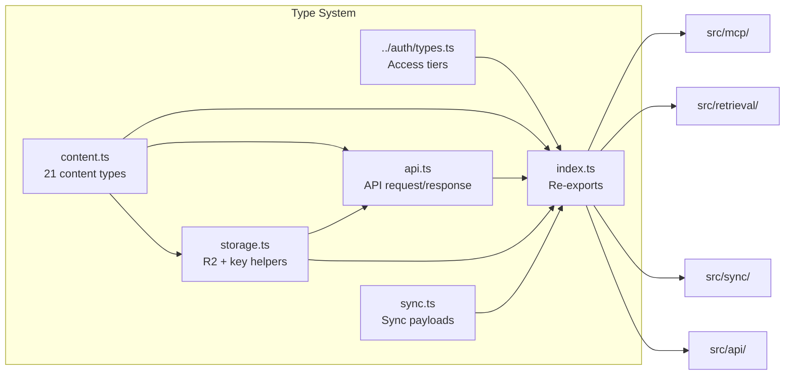

# Types

> Defines the entire type system: 21-type content ontology, auth model, API shapes, storage schemas, and sync payloads.

**Source:** `src/types/`
**Files:** 6 (`index.ts`, `content.ts`, `api.ts`, `storage.ts`, `sync.ts`, `rpc.ts`) + auth types re-exported from `@superbenefit/porch/auth`
**Spec reference:** `docs/spec.md` sections 2, 3, 4, 5, 6, 8
**Depends on:** none (leaf module)
**Depended on by:** `retrieval`, `sync`, `mcp`, `api`, `index`

---

## Overview

The types directory is the foundation of the entire codebase. Every other module imports from it, and nothing imports into it. It defines Zod schemas that serve triple duty: runtime validation, TypeScript type inference, and OpenAPI documentation generation (via `@hono/zod-openapi`).

The type system models SuperBenefit's knowledge ontology — a 21-type hierarchy of content ranging from governance patterns and coordination protocols to people, groups, and events. This ontology is reflected in storage (R2 key paths), search (filter schemas), and API responses.

Shared schemas (`R2Document`, `SearchResult`, etc.) are canonical in `@superbenefit/knowledge-schemas` and re-exported here. Content schemas remain local.

## Data Flow Diagram

## File-by-File Reference

### `index.ts`

**Purpose:** Barrel file that re-exports all types, schemas, and helpers from the other files.

#### Exports

All exports are re-exports. Organized into sections by spec reference:

| Section | Schemas | Types | Helpers |
|---------|---------|-------|---------|
| Content (spec 3) | `ContentTypeSchema`, `FileSchema`, `ResourceSchema`, `StorySchema`, `DataSchema`, `ReferenceSchema`, `ContentSchema`, + 14 concrete schemas | `ContentType`, `Content`, `FileFrontmatter`, + 14 concrete frontmatter types | `inferContentType`, `RESOURCE_TYPES`, `STORY_TYPES`, `REFERENCE_TYPES`, `DATA_TYPES`, `PATH_TYPE_MAP` |
| Auth (spec 2) | `AccessTierSchema`, `IdentitySchema`, `AuthContextSchema` | `AccessTier`, `Identity`, `AuthContext` | `TIER_LEVEL` |
| API (spec 6, 8) | `SearchFiltersSchema`, `ListParamsSchema`, `SearchParamsSchema`, `SearchResultSchema`, `ErrorResponseSchema`, `EntryResponseSchema`, `EntryListResponseSchema`, `SearchResponseSchema` | `SearchFilters`, `ListParams`, `SearchParams`, `SearchResult`, `ErrorResponse` | |
| Storage (spec 4) | `R2DocumentSchema` | `R2Document` | `generateId`, `toR2Key`, `extractIdFromKey`, `extractContentTypeFromKey` |
| Sync (spec 5) | `SyncParamsSchema` | `SyncParams`, `GitHubPushEvent`, `ParsedMarkdown` | |
| RPC (spec v0.17) | | `SearchKnowledgeParams`, `SearchKnowledgeResult`, `GetDocumentParams`, `DefineTermParams`, `DefineTermResult`, `ListGroupsResult`, `ListReleasesResult` | |

#### Dependencies
- **Internal:** `./content`, `@superbenefit/porch/auth`, `./api`, `./storage`, `./sync`
- **External:** none

---

### `content.ts`

**Purpose:** Defines the 21-type content ontology as a Zod schema hierarchy with discriminated union.

See `docs/ontology.md` for the full ontology definition.

#### Dependencies
- **External:** `@hono/zod-openapi` (Zod with OpenAPI extensions)

---

### `api.ts`

**Purpose:** Re-exports API request/response shapes from `@superbenefit/knowledge-schemas`.

Schemas include: `SearchFiltersSchema`, `ListParamsSchema`, `SearchParamsSchema`, `SearchResultSchema`, `ErrorResponseSchema`, `EntryResponseSchema`, `EntryListResponseSchema`, `SearchResponseSchema`.

#### Dependencies
- **External:** `@superbenefit/knowledge-schemas`

---

### `storage.ts`

**Purpose:** Re-exports R2 document shape and key helpers from `@superbenefit/knowledge-schemas`.

Exports: `R2DocumentSchema`, `R2Document`, `generateId`, `toR2Key`, `extractIdFromKey`, `extractContentTypeFromKey`.

#### Dependencies
- **External:** `@superbenefit/knowledge-schemas`

---

### `sync.ts`

**Purpose:** Defines payload types for the sync pipeline: workflow params, GitHub webhooks, and parsed markdown.

#### Exports

| Export | Kind | Description |
|--------|------|-------------|
| `SyncParamsSchema` | Zod object | Workflow input: `{ changedFiles: string[], deletedFiles: string[], commitSha: string }` |
| `SyncParams` | Type | Inferred type |
| `GitHubPushEvent` | Interface | Subset of GitHub push webhook: `{ ref, after, commits: [{ added, modified, removed }] }` |
| `ParsedMarkdown` | Interface | `{ frontmatter: Record<string, unknown>, body: string, parseError?: string }` |

#### Dependencies
- **External:** `zod`

---

### `rpc.ts`

**Purpose:** Defines RPC parameter and result types for the WorkerEntrypoint service binding interface.

#### Exports

| Export | Kind | Description |
|--------|------|-------------|
| `SearchKnowledgeParams` | Interface | `{ query, contentType?, group?, release?, limit? }` |
| `SearchKnowledgeResult` | Interface | `{ items: SearchResult[], total: number }` |
| `GetDocumentParams` | Interface | `{ contentType, id }` |
| `DefineTermParams` | Interface | `{ term }` |
| `DefineTermResult` | Interface | `{ term, definition: string \| null }` |
| `ListGroupsResult` | Interface | `{ groups: Array<{ id, title, description? }> }` |
| `ListReleasesResult` | Interface | `{ releases: Array<{ id, title, description? }> }` |

#### Dependencies
- **Internal:** `./content` (ContentType), `./api` (SearchResult), `./storage` (R2Document)

---

## Key Types

| Type | Owner | Used By | Description |
|------|-------|---------|-------------|
| `ContentType` | `content.ts` | Everything | Union of 21 content type strings |
| `R2Document` | `@superbenefit/knowledge-schemas` | `sync`, `retrieval`, `mcp`, `api` | The canonical document stored in R2 |
| `AuthContext` | `@superbenefit/porch/auth` | `mcp` | Resolved access context for a request |
| `SearchResult` | `@superbenefit/knowledge-schemas` | `retrieval`, `mcp`, `api` | Search result returned to clients |
| `SyncParams` | `sync.ts` | `sync` | Workflow input payload |

## Extension Points

**Adding a new content type:**
1. Add the type literal to `ContentTypeSchema` enum in `content.ts`
2. Create a concrete schema extending the appropriate parent (`ResourceSchema`, `StorySchema`, etc.)
3. Add the type to the relevant `*_TYPES` array
4. Add a path prefix mapping to `PATH_TYPE_MAP`
5. Add the schema to the `ContentSchema` discriminated union
6. Export the schema and type from `index.ts`

## Cross-References

- [retrieval](../retrieval/) — How `SearchFilters` and `SearchResult` drive search
- [sync](../sync/) — How `SyncParams` and `ParsedMarkdown` drive the sync pipeline
- `docs/spec.md` sections 2-8 — Full specification for each type category
